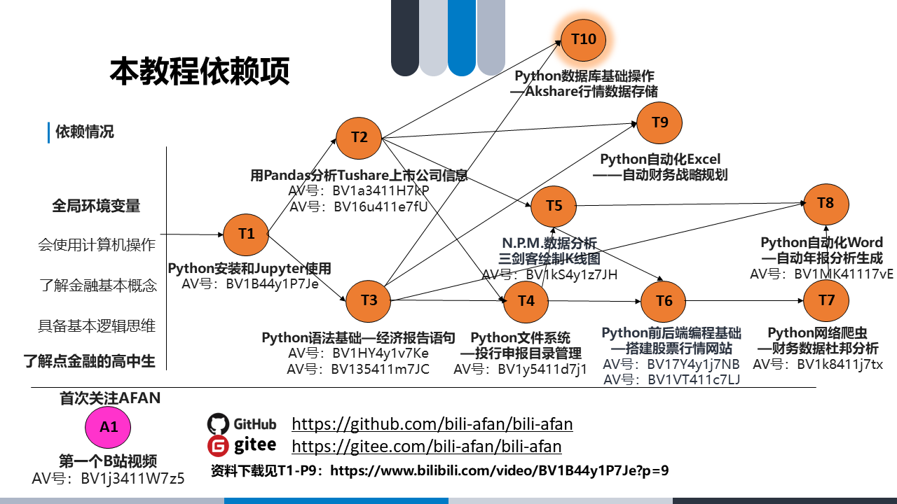

<h1 align="center">
   
     
</h1>

    <strong>B站费曼区UP主BILI-AFAN的资料汇总</strong>

**Github地址**：https://github.com/bili-afan/bili-afan

**Gitee地址**：https://gitee.com/bili-afan/bili-afan

# 学习视频路径

**这是什么：** 由于AFAN的视频都偏学习类，是学习就会有渐进的关系，所以AFAN想用这个学习路径图帮助大家可以从零到一实现某项场景技术。

**如何使用：** 如果你碰到了感兴趣的教学视频，但是苦于没有基础的话，那么没关系，**从下面的路径图倒推，逐个看完AFAN的视频就大概率能掌握了** 如果发现中间有些阻塞，肯定是AFAN讲的有些跳跃了，欢迎你到评论区或弹幕区留言，AFAN后面有时间会进行修正，也会把大家的公共问题放到这个仓库当中。

# A-公告

| 上传时间   | 标题             | 资料目录                   | 视频地址                                               | 说明                   |
| ---------- | ---------------- | -------------------------- | ------------------------------------------------------ | ---------------------- |
| 2022.03.28 | A1 第一个B站视频 | 本仓库内Announcement文件夹 | [B站地址](https://www.bilibili.com/video/BV1j3411W7z5) | 了解AFAN视频必看第一个 |

# T-教学

| 上传时间   | 标题                             | 资料目录                                                  | 视频地址                                               | 说明               |
| ---------- | -------------------------------- | --------------------------------------------------------- | ------------------------------------------------------ | ------------------ |
| 2022.03.31 | T1 Python安装和Jupyter使用       | 本仓库内Teaching文件夹 | [B站地址](https://www.bilibili.com/video/BV1B44y1P7Je) | 学Python第一个视频 |
| 2022.04.05 | T2.1 Tushare金融数据和Pandas介绍 | 本仓库内Teaching文件夹 | [B站地址](https://www.bilibili.com/video/bv1a3411H7kP) | T2拆解后的上部分   |
| 2022.04.05 | T2.2 Pandas分析Tushare上市公司信息 | 本仓库内Teaching文件夹 | [B站地址](https://www.bilibili.com/video/BV16u411e7fU) | T2拆解后的下部分   |
| 2022.04.19 | T3.1 Python语法基础——经济数据语句简单输出 | 本仓库内Teaching文件夹 | [B站地址](https://www.bilibili.com/video/BV1HY4y1v7Ke/) | T3拆解后的上部分 |
| 2022.04.20 | T3.2Python语法基础——复杂输出和抽象封装    | 本仓库内Teaching文件夹 | [B站地址](https://www.bilibili.com/video/BV135411m7JC/) | T3拆解后的下部分 |
| 2022.05.09 | T4 Python文件系统——高效管理投行申报目录 | 本仓库内Teaching文件夹 | [B站地址](https://www.bilibili.com/video/BV1y5411d7j1/) | 一个综合的知识锻炼 |
| 2022.05.26 | T5 Numpy+Pandas+Matplotlib——用Python绘制股票K线图 | 本仓库内Teaching文件夹 | B站审核中 | 三剑客在手，数据分析随便走 |

# L-学习

# P-工程

# S-分享

# I-生活

